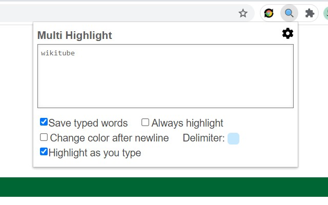
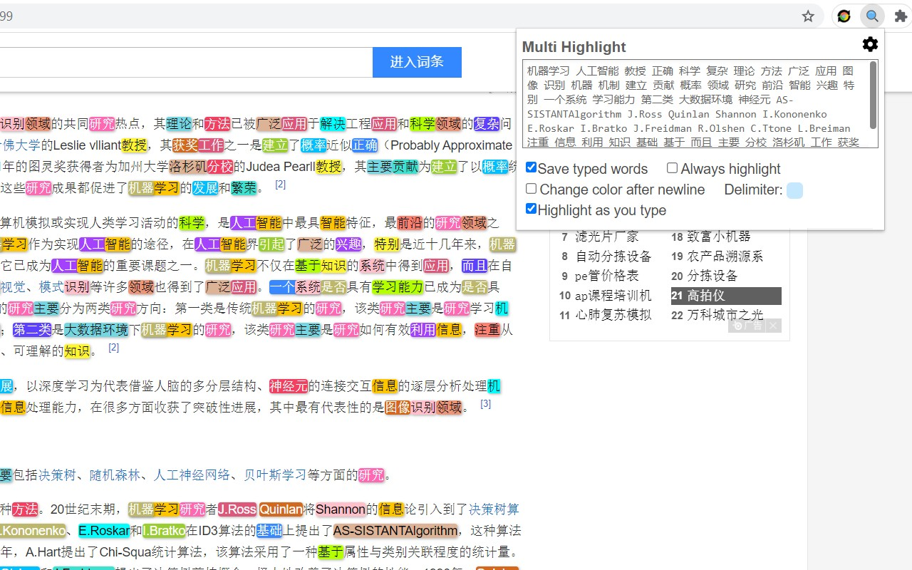

# Multi-Highlight

An efficient tool to highlight all words you want in webpages
快速標記網頁關鍵詞，自動高亮標記所有你想要的字詞
キーワードをすばやくマークし、必要なすべての単語を自動的に強調表示します

* Support memorizing typed words
* Support always highlighting mode
* Support grouping words by colors
* Support customizable delimiter
* Support highlight as you type

* does not support PDF, iframe element

Changelog:
20210519
* Improve UI
* Change Logo
* Add "Always highlight" feature
* Add "Change color after newline" feature
* Fix unstable typesetting issue when typing
* Add 10 more highlight colors

20191028
* Customizable window size
* Add 4 more colors (now contains 10 colors)

20190609
* Add "paste keywords to new pages" mode

20190503
* Minimize extension size

20190110
* Highlight any strings (not just full word)
* Add Instant Search (highlight on-the-fly)
* Add customizable delimiter
* Make Highlight Words individual to each tab
* UI changes
* Add Ctrl+Shift+F as default shortcut

20181231
* Organize code
* Change UI (based on Multi-Highlight)
* Change extension icon

## User Interface  
  

## Demo  
  