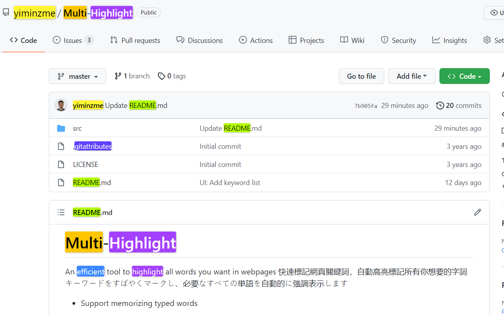

#  Multi-Highlight

An essential tool to highlight all words you want in webpages  
快速標記網頁關鍵詞，自動高亮標記所有你想要的字詞  

✔️ Highlight on-the-fly  ✔️ Auto-highlight  ✔️ Flexible delimiter  ✔️ Savable words list  ✔️ Whole word search  ✔️ Case sensitivity  ✔️ Group words by colors  

## Updates: 

2022 June  
* Improve adaptability -- add support to highlight asynchronous text (e.g. AJAX content)
* Fix option page's saving issue

2022 January  
* Support nested highlight
* Bug fix: innerHTML deleted unintentionally
* Bug fix: Word boundary not working for keyword-list
* DEV Change keyword data structure and update the version to "2.8.0" due to 
* Feature Re-highlighting.
* Feature Toggle highlighting.
* Improve stability
* Adjust interface
* Fix bug (show current keyword list right after popup; properly remove highlights when NewLineNewColor mode is on)

2021 December
* Add options: Whole words only, Casesensitive
* Update the highlight lib from [npmjs](https://www.npmjs.com/package/jquery-highlight)
* Modified: Handle the options change in one callback function.
* Modified: Use 2D array to store the keywords in `NewColorNewLine` mode.
* Bugfix: Keywords removal should not remove the container.
* Add keywords display zone
* Check wheter the page contains the keyword(s) or not, if not, gray it
* `Ctrl+Click` to delete the correspond keyword

2021 August
* Fix user settings reset after browser update

2021 May
* Improve UI
* Change Logo
* Add "Always highlight" feature
* Add "Change color after newline" feature
* Fix unstable typesetting issue when typing
* Add 10 more highlight colors (now contains 20 colors)

2019 October
* Customizable window size
* Add 4 more colors (now contains 10 colors)

2019 June
* Add "paste keywords to new pages" mode

2019 May
* Minimize extension size

2019 January
* Highlight any strings (not just full word)
* Add Instant Search (highlight on-the-fly)
* Add customizable delimiter
* Make Highlight Words individual to each tab
* UI changes
* Add Ctrl+Shift+F as default shortcut

2018 December
* Organize code
* Change UI (based on Multi-Highlight)
* Change extension icon