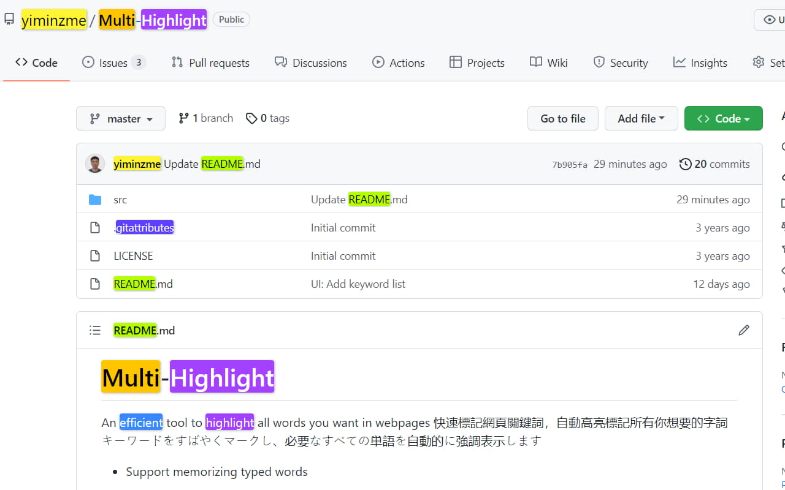

#  Multi-Highlight

Are you tired of losing track of important information in your online reading? Multi Highlight is here to help! With this powerful and efficient chrome extension, you can easily highlight all your user-specified words in webpages with beautiful colors.

Multi Highlight can do real-time highlighting as you type, automatically re-highlight your word list when the webpage content changes or when the page is loaded, and it accepts custom word separators. You can save your user-specified word list, do whole word and case-sensitive searches, and even group words by colors.

With Multi Highlight, you can stay focused and efficient while reading online. It's perfect for students and professionals who regularly read online content for studying or work. Try Multi Highlight today and take your online reading to the next level!

Features:   
✔️ Real-time Highlight as you type  
✔️ Auto-ReHighlight  
✔️ Customizable word separator  
✔️ Whole word, Case-sensitivity Search  
✔️ Group words by colors    

## Updates: 

2023 February
* Adapt to manifest V3
* Refresh words (1) when textbox is focused but inactive for short a period (2) when popup is closed
* Fix style broke in browser's built-in page and in pages that loaded before extension installation. In these pages, disable textbox and show notification
* Update UI

2022 September
* Feature Auto-Rehighlight
* Bug fix: rehighlight words when extension is softly disabled
* Bug fix: webpage broke if website customize  element

2022 June  
* Improve adaptability -- add support to highlight asynchronous text (e.g. AJAX content)
* Fix option page's saving issue

2022 January  
* Support nested highlight
* Bug fix: innerHTML deleted unintentionally
* Bug fix: Word boundary not working for keyword-list
* DEV Change keyword data structure and update the version to "2.8.0" due to 
* Feature Re-highlighting.
* Feature Toggle highlighting.
* Improve stability
* Adjust interface
* Fix bug (show current keyword list right after popup; properly remove highlights when NewLineNewColor mode is on)

2021 December
* Add options: Whole words only, Casesensitive
* Update the highlight lib from [npmjs](https://www.npmjs.com/package/jquery-highlight)
* Modified: Handle the options change in one callback function.
* Modified: Use 2D array to store the keywords in `NewColorNewLine` mode.
* Bugfix: Keywords removal should not remove the container.
* Add keywords display zone
* Check wheter the page contains the keyword(s) or not, if not, gray it
* `Ctrl+Click` to delete the correspond keyword

2021 August
* Fix user settings reset after browser update

2021 May
* Improve UI
* Change Logo
* Add "Always highlight" feature
* Add "Change color after newline" feature
* Fix unstable typesetting issue when typing
* Add 10 more highlight colors (now contains 20 colors)

2019 October
* Customizable window size
* Add 4 more colors (now contains 10 colors)

2019 June
* Add "paste keywords to new pages" mode

2019 May
* Minimize extension size

2019 January
* Highlight any strings (not just full word)
* Add Instant Search (highlight on-the-fly)
* Add customizable delimiter
* Make Highlight Words individual to each tab
* UI changes
* Add Ctrl+Shift+F as default shortcut

2018 December
* Organize code
* Change UI (based on Multi-Highlight)
* Change extension icon